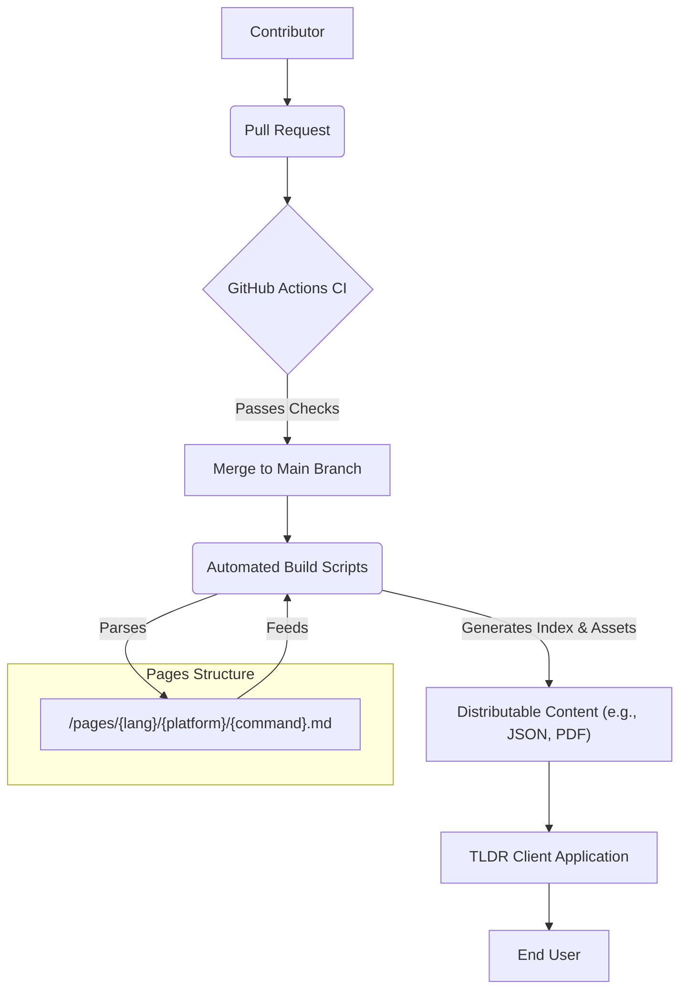

# 🚀 TLDR Community Pages


## Short Description

**Never feel lost at the command line again!** This repository is the heart of the `tldr` project, a community-driven collection of simplified, example-rich man pages that make common command-line tools immediately understandable. Forget wading through verbose documentation; `tldr` delivers practical, real-world usage examples straight to your terminal, in your language.

## ✨ Key Features

*   **🌐 Multilingual Support:** Commands are translated and maintained in numerous languages, ensuring accessibility for a global audience. (e.g., Arabic, Bengali, Chinese, German, Spanish, French, Hindi, Indonesian, Italian, Japanese, Korean, Dutch, Polish, Portuguese, Russian, Swedish, Turkish, Ukrainian, and more!)
*   **💻 Multi-Platform Coverage:** Examples for a vast array of operating systems and environments, including `common`, `Linux`, `macOS (osx)`, `Windows`, `Android`, `FreeBSD`, `NetBSD`, `OpenBSD`, `Solaris (sunos)`, and `Cisco IOS`.
*   **🤝 Community-Powered:** Driven by a passionate global community, ensuring up-to-date and relevant examples for thousands of commands. Contributions are highly encouraged and streamlined.
*   **⚙️ Robust CI/CD Pipeline:** Automated checks for syntax, style, and consistency ensure high-quality content. Dependabot keeps our dependencies secure and updated.
*   **📦 Comprehensive Contribution Guides:** Detailed guides for maintainers, style guidelines (including localized versions), and Git terminal usage make contributing straightforward for everyone.
*   **🚀 Developer-Friendly Environment:** Ready-to-use development container configuration for VS Code, enabling instant setup and smooth development workflows.
*   **📄 Content Generation & Tooling:** Scripts for building indices, generating PDF documentation, and managing page aliases and links, providing versatile ways to consume and maintain content.

## Who is this for?

*   **Developers & System Administrators:** Quickly recall complex command syntax or discover new usages.
*   **Beginners:** Get up and running with command-line tools without the steep learning curve.
*   **Open Source Enthusiasts:** Contribute to a widely used project, practice writing technical documentation, or get involved in translation efforts.
*   **Educators:** Provide clear, concise examples for teaching command-line fundamentals.
*   **Anyone who uses the terminal!**

## Technology Stack & Architecture

Our project leverages a simple yet powerful stack for content management, automation, and delivery:

*   **Content Format:** Markdown (`.md`)
*   **Scripting & Automation:** Python, JavaScript (Node.js), Shell Scripting
*   **Package Management:** npm (`package.json`) for JavaScript, pip (`requirements.txt`) for Python
*   **Continuous Integration/Deployment:** GitHub Actions
*   **Code Quality:** Flake8, Markdownlint, Codespell
*   **Development Environment:** VS Code Dev Containers
*   **Branding & Assets:** Fonts (`.ttf`), Images (`.png`, `.svg`)

## 📊 Architecture & Database Schema

The TLDR project's "database" is its intelligently structured file system, enabling flexible content management and rapid retrieval.



## ⚡ Quick Start Guide

Ready to dive in or contribute?

1.  **Clone the Repository:**
    ```bash
    git clone https://github.com/tldr-pages/tldr.git
    cd tldr
    ```
2.  **Explore the Pages:**
    Browse the `pages/` directory to see the organized command-line examples. For instance:
    ```bash
    # View common 'git' commands in English
    cat pages/common/git.md

    # View 'apt' commands for Linux in German
    cat pages.de/linux/apt.md
    ```
3.  **Contribute:**
    We welcome all contributions! Check out our comprehensive guides to get started:
    *   [Contributing Guide](CONTRIBUTING.md)
    *   [Style Guide](contributing-guides/style-guide.md)

## 📜 License

This project is licensed under the [MIT License](LICENSE.md).
