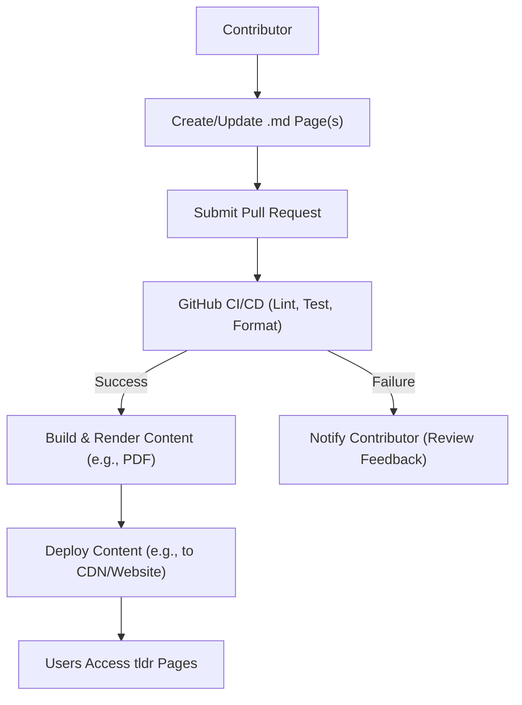

# 🚀 tldr-pages: The Simplified, Community-Driven Command Line Reference

<p align="center"></p>

## Short Description
`tldr-pages` is an indispensable, community-driven collection of simplified and practical examples for common command-line tools. Forget endless `man` pages; `tldr-pages` delivers immediate, actionable syntax and usage tips, tailored for various operating systems and localized into numerous languages. It's the ultimate quick reference for developers, system administrators, and anyone who lives in the terminal.

## ✨ Key Features
*   **Instant Command Examples:** Get straight to the point with practical, real-world examples for hundreds of commands.
*   **Multi-Platform Support:** Access commands relevant to Android, Linux, macOS, Windows, FreeBSD, NetBSD, OpenBSD, SunOS, and even Cisco IOS.
*   **Global Accessibility:** Content is translated and maintained across numerous languages, ensuring you get help in your preferred language.
*   **Community-Powered:** A vibrant open-source community maintains and expands the content, ensuring accuracy and relevance.
*   **Rich Contribution Guidelines:** Comprehensive guides and templates streamline contributions, making it easy for anyone to improve the project.
*   **Automated Quality Assurance:** Robust CI/CD pipelines automate linting, testing, and formatting to maintain high content quality.
*   **PDF Generation:** Scripts are available to generate beautiful, themed PDF versions of the pages for offline access or printing.
*   **Developer-Friendly Setup:** Includes `.devcontainer` configurations for seamless development in cloud or local VS Code environments.

## Who is this for?
*   **Command Line Enthusiasts:** Developers, DevOps engineers, and system administrators looking for faster, more digestible command-line help.
*   **New CLI Users:** A perfect entry point for those intimidated by traditional `man` pages.
*   **Open Source Contributors:** Individuals passionate about technical writing and community-driven documentation.
*   **Multi-Lingual Teams:** Anyone needing command references in languages other than English.

## Technology Stack & Architecture
The `tldr-pages` project is a documentation repository, emphasizing content over complex application logic, yet it utilizes a robust set of tools for content management and delivery.

*   **Content Format:** Markdown (`.md`)
*   **Scripting & Automation:** Python (for rendering, command updates, bot interactions), Bash (for CI/CD, build, and deployment scripts)
*   **Build & Tooling:** Node.js/NPM (`package.json`) for managing development dependencies.
*   **Styling & Fonts:** CSS (`.css`) and TrueType Fonts (`.ttf`) for aesthetically pleasing PDF outputs.
*   **Continuous Integration/Delivery (CI/CD):** GitHub Actions (`.github/workflows`) for automated testing, linting, code spell checking, and deployment.
*   **Code Quality:** `flake8` (Python linting), `markdownlint` (Markdown linting), `codespell` (spell checking), `.editorconfig` for consistent formatting.
*   **Developer Experience:** `.devcontainer` for standardized development environments.

## 📊 Architecture & Database Schema
This project is a static content repository, not a traditional application with a database. Its "architecture" defines the flow of content creation and distribution.



## ⚡ Quick Start Guide
To quickly get up and running with `tldr-pages`:

1.  **Clone the Repository:**
    ```bash
    git clone https://github.com/your-org/tldr-pages.git
    cd tldr-pages
    ```
2.  **Explore Pages:**
    Browse the `pages/` directory to explore command examples for various platforms and languages. For instance, to see common Linux commands:
    ```bash
    ls pages/linux/
    cat pages/linux/apt.md
    ```
3.  **Contribute to the Project:**
    To add new pages or improve existing ones, refer to our detailed contribution guidelines:
    ```bash
    cat CONTRIBUTING.md
    cat contributing-guides/style-guide.md
    ```
4.  **Generate PDF (Optional):**
    If you want to create a local PDF version of the pages:
    ```bash
    # Install Python dependencies for PDF generation
    pip install -r scripts/pdf/requirements.txt
    
    # Run the PDF build script
    ./scripts/pdf/build-pdf.sh
    ```

## 📜 License
This project is licensed under the [MIT License](LICENSE.md).